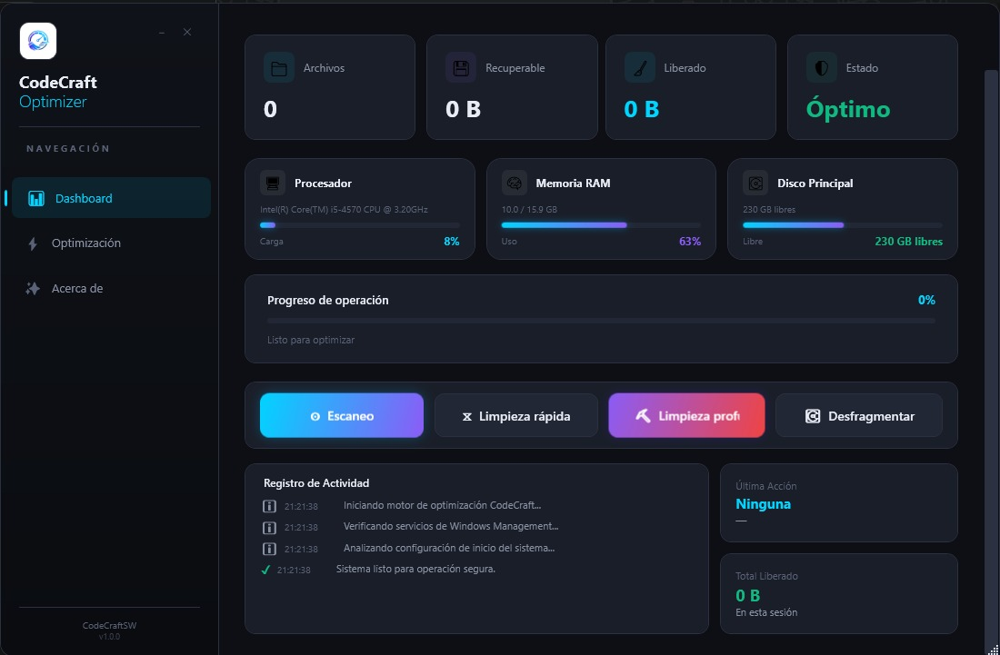
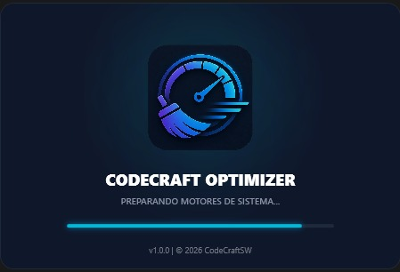
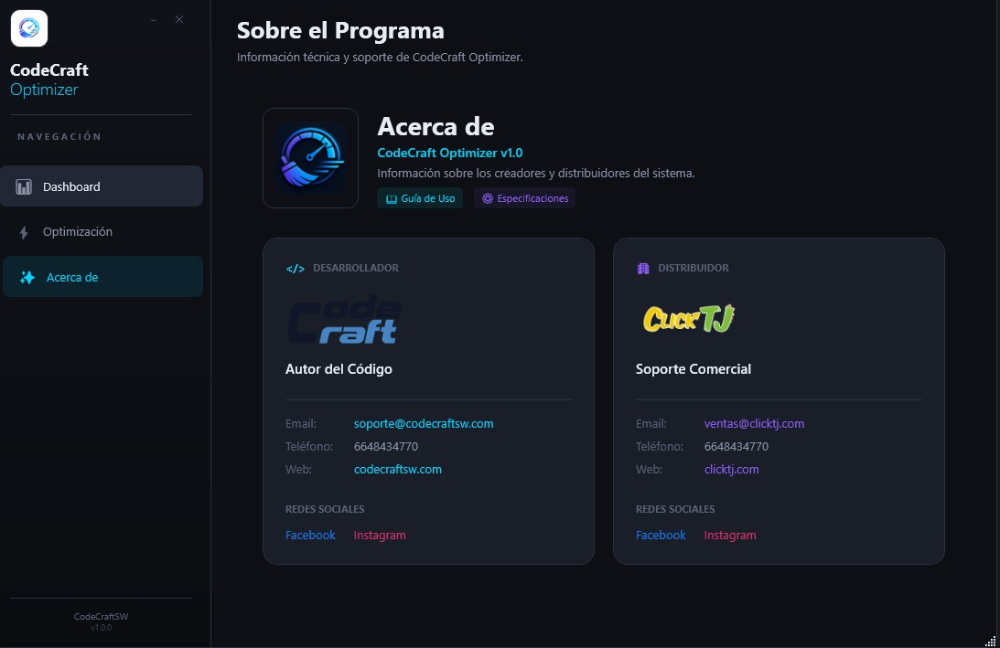

# CodeCraft Optimizer

**CodeCraft Optimizer** es una solución profesional de alto rendimiento diseñada para el monitoreo, limpieza y optimización de sistemas operativos Windows.

---

## 📥 Descarga el Ejecutable
Para utilizar la aplicación sin necesidad de compilar el código, descarga la última versión estable desde nuestra sección de lanzamientos:

👉 **[DESCARGAR AQUÍ (CodeCraftOptimizer.exe)](https://github.com/IngSebastianGallegos/CodeCraft-Optimizer/releases)**

---

## Características Principales

- **Dashboard en Tiempo Real:** Visualización precisa del uso de CPU, Memoria RAM y Almacenamiento.
- **Gestor de Inicio Inteligente:** Control total sobre las aplicaciones que se inician con Windows (estilo Administrador de Tareas).
- **Motor de Limpieza Instantáneo:** Algoritmos optimizados para liberar espacio en disco en segundos sin bloquear la interfaz.
- **Experiencia de Usuario Premium:** Pantalla de inicio animada y diseño oscuro minimalista.

## Requisitos del Sistema

- **Sistema Operativo:** Windows 10 o Windows 11.
- **Arquitectura:** x64.
- **Dependencias:** Requiere [.NET 8.0 Desktop Runtime](https://dotnet.microsoft.com/download/dotnet/8.0).

## Capturas de Pantalla

### Dashboard Principal

### Pantalla de Inicio (Splash Screen)

### Sección de Créditos y Soporte

---

## Desarrollo y Licencia

Este proyecto es propiedad de **CodeCraftSW** y es distribuido oficialmente por **ClickTj**.

- **Desarrollador:** Sebastián Gallegos
- **Tecnologías:** C#, WPF, .NET 8.0, WMI.

---
**Nota para desarrolladores:** Este repositorio contiene el código fuente completo. Para compilarlo, abre el archivo `.sln` en Visual Studio 2022 o superior.
